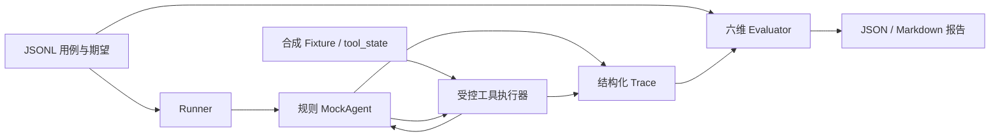

# Agent Eval Lab — 当前状态审查

审查日期：2026-09-16（Asia/Shanghai）。源码基线：`123d9f75a1c95d8bb9701f7da2972984a5508e13`。

## 1. 发布判断

**已有完整、可运行的离线评测闭环，足够制作演示；暂不建议直接作为公开发布版本。** 阻塞主要是评测可信度边界、运行产物保护和入口文档，不是功能数量不足。具体收敛到 [RELEASE_GAPS.md](RELEASE_GAPS.md) 的 5 个 P0。

建议定位：

> 面向 Agent 开发与测试人员的订单查询评测实验室：通过可重放的工具调用记录，检查任务结果、参数、证据引用和异常处理，并定位具体失败原因。

公开名称可以使用 **Agent Eval Lab — OrderTrace Eval**，解释仓库名称与现有报告标题的关系即可，不必重命名包、文件或历史证据。

这是一个受限业务场景的本地 CLI 和参考实现。当前不是通用 Agent 接入平台，也不是运行时调用 Astra 的产品。最有价值的演示是：**最终事实正确，引用不存在，仍然应当 FAIL**；以及**工具超时后正确降级，可以 PASS**。

## 2. 审查范围与证据边界

- 建立全部 50 个 Git 跟踪文件的清单；检查全部 Python 文件的 AST、全部 JSON/JSONL 的可解析性，审阅入口、全部运行模块、测试、数据合同、生成/QA 流程、README、计划/状态记录与历史证据。
- 清单分布：15 个 Python、16 个 Markdown、14 个 JSON、2 个 JSONL，另有 requirements、pytest 配置和 `.gitignore`。没有应用前端、服务端启动器或容器配置。
- 在独立本地克隆中创建全新 `.venv`，从 `requirements.txt` 安装，执行现有测试及正反向 smoke。数据重新生成仅发生在临时克隆中。
- 原工作区起始干净；本阶段不修改既有源码、测试、README、依赖或数据集，不提交、不推送、不发布。
- 本次可共享的验证摘要：[release_audit_20260916.json](docs/evidence/release_audit_20260916.json)。详细本地产物在 `artifacts/release_audit_20260916/`，受现有 `.gitignore` 忽略，不会随 clone 分发。
- 未验证：远程公开 clone、Linux/macOS、其他 Python 版本、真实 LLM、生产数据、用户独立演示、PH 登录后的提交规则。测试通过不等于这些能力成立。

## 3. 实际可以完成什么

| 环节 | 实际能力 | 代码/运行依据 |
| --- | --- | --- |
| 输入 | 从 JSONL 读取用例；CLI 用 `--case` 选择，不提供交互聊天或任意文本输入参数 | `run_eval.py:28`、`order_eval/schemas.py:285` |
| 样本 | v1：28 条、7 类；v2：500 条、15 类，自包含合成工具状态 | `datasets/cases.jsonl`、`datasets/expansion/round_001.jsonl` |
| Agent | `MockAgent.run(user_input, tool_executor)`；中文关键词分类、订单号解析、结构化回答 | `order_eval/agent.py:47` |
| 工具 | `get_order`、`get_shipment` 两个本地只读工具；参数检查、前置条件、TIMEOUT 重试一次、最多 4 次实际尝试 | `order_eval/tools.py` |
| 隔离 | 每个 trial 建立独立工具世界，深复制数据并重置故障计数 | `run_trial`、`load_fixture_world`、`build_world_from_state` |
| Trace | 输入、工具名/参数、每次尝试、原始及标准化工具结果、答案、评估、散列和版本 | `order_eval/runner.py:100` |
| Evaluation | 6 个固定规则维度，PASS/FAIL/N/A；整体 PASS/FAIL/ERROR；失败带规则码及 expected/actual | `order_eval/evaluator.py:31` |
| 报告 | `run.json`、`traces.jsonl`、`report.json`、`report.md`；Markdown 与 JSON 来自同一报告结构 | `order_eval/runner.py:399` |
| 重放 | 对保存的 Trace 重新评分，不重新执行 Agent/工具；检查 dataset hash | `order_eval/runner.py:436`，本次 v1 28/28、v2 430/430 MATCH |
| 回归 | 同数据/工具 schema/评测器版本/模式/用例集合比较；报告逐 case 变化 | `order_eval/runner.py:580`，默认单 trial 路径已验证 |
| 确定性 | `--check-determinism 3` 真正执行三次，比较规范化 Trace | `order_eval/runner.py:551`，本次 identical=True |
| 缺陷故事 | 已存档 T01 重试成功却误报 unavailable 的旧缺陷与修复证据 | `docs/evidence/t01_timeout_retry_defect/`，本次重新评分为 FAIL / PASS |

核心链路：

Agent 只拿用户输入和工具执行接口，不拿标准答案；Evaluator 读取用例期望与 Trace。两者共享部分 schema/输入解析规则，因此不能把自建样本成绩称为独立模型基准。

## 4. 六个维度实际检查什么

| 维度 | 检查内容 | 重要限制 |
| --- | --- | --- |
| `task_success` | 状态、原因码、必需事实、目标订单号是否符合用例期望 | 是订单合同的任务成功，不是任意现实任务完成证明 |
| `tool_selection` | 允许/必需工具、调用次数、先查订单再查物流 | 依赖本项目 Trace 合同 |
| `tool_argument` | 参数 schema 拒绝记录、目标订单号 | 不是任意工具参数的通用判定器 |
| `groundedness` | 每项事实引用的 call_id、来源工具、JSON 指针和值 | 只覆盖结构化字段，不评自由文本幻觉 |
| `output_format` | 解析后对象的 schema 和 raw 字段存在性 | **当前未核对 raw 能否解析及其与对象的一致性，见 P0-2** |
| `constraint_following` | 禁止调用、只读限制、重复尝试上限等固定规则 | 不动态执行 v2 的 `evaluation_rules` |

v2 的 70 条上下文依赖用例被明确跳过，原因是 `AGENT_NO_SESSION_STATE`。其中包含多轮和记忆用例，不能算作通过。另有 **35 条实际执行用例带 `llm_judge` 元数据，但没有执行 Judge**；430 PASS 只证明固定六维规则通过，不代表数据行列出的所有扩展规则都执行过。

数据生成器和 QA 均复用生产输入解析器，存在共同假设；QA 本次无 error，但有模板重复片段、附加字段未作必需事实、部分类别难度单一等 warning。不能宣称独立盲测、真实业务覆盖或通用提示注入防御能力。

## 5. 安装、环境与启动

本次实测：**Windows 11、Python 3.13.14、pytest 9.0.3、jsonschema 4.26.0**。README 中“Windows 10”属于原记录，不能当成本次环境。

- 本地 `git clone --no-hardlinks` 成功；当前原仓库 `git remote -v` 无输出。尚无可从 Git 配置核验的公开 clone 地址。
- `python -m venv` 成功，全新环境 `pip install -r requirements.txt` 成功；没有修改 pip 或系统配置。
- `pip check` 无冲突。两个直接依赖锁定版本，传递依赖没有锁定；完整实装清单在证据摘要中。
- 当前运行代码不读取 API Key 或 `.env`，不需要设置环境变量。规格中的 `LLM_API_KEY`、`LLM_BASE_URL`、`LLM_MODEL` 是未实施设计，不是当前配置要求。
- 启动即运行 `run_eval.py`，没有 HTTP 服务或需要等待的端口；必须先进入仓库根目录，默认数据路径相对当前目录。
- Windows 可以直接调用 `.venv\Scripts\python.exe`，不需要激活脚本或修改执行策略。
- **本机默认 GBK 的重定向输出中，QA 命令会因打印 `✓` 报 UnicodeEncodeError。** `python -X utf8 data_factory/validate_round1.py` 已验证通过。`-X utf8` 只影响该 Python 进程，无须持久环境变量或重启。
- 安装需要获取依赖；安装完成后的 offline 评测不需要网络/API。pytest 在进程内拦截两个 socket 连接入口，这不是操作系统级网络隔离承诺。

## 6. 本次测试与 smoke 结果

下表的 `python` 指干净克隆中的虚拟环境解释器；主要审查子进程使用 `PYTHONIOENCODING=utf-8` 捕获日志。默认编码与 `-X utf8` 路径另行验证。

| 验证 | 结果 | 退出码 / 时间 |
| --- | --- | --- |
| `python -m pytest -q` | **112 passed**，无 skip/xfail | 0；pytest 88.45 秒 |
| `python run_eval.py --mode offline` | 28 PASS / 0 FAIL / 0 ERROR，score 100 | 0；3.26 秒 |
| N02 / T02 单 case | 各 1 PASS；N02 两工具，T02 两次超时后 unavailable | 各 0 |
| 默认运行的 `--replay` | 28 MATCH / 0 mismatch / 0 error | 0；0.91 秒 |
| 默认运行的 `--baseline` | 可比，0 regression | 0；3.45 秒 |
| `--check-determinism 3` | 三次 28 PASS，identical=True | 0；8.30 秒 |
| 扩展集运行 | 数据集 500；执行 430 PASS；跳过 70 | 0；42.96 秒 |
| 扩展集重放 | 430 MATCH | 0；0.92 秒 |
| 独立 QA / 重新生成再 QA（UTF-8） | 无 error，保留 warning；生成前后扩展 JSONL 字节一致 | 各 0 |
| T01 历史 FAIL/FIXED Trace 重新评分 | 旧记录仍 FAIL，修复记录 PASS；判定重放各 MATCH | 各 0；不是本次新修复 |
| 临时 Fixture 将 N01 状态改为 CANCELED | 1 FAIL，`task_success/TS-FACTS`，报告正常落盘 | 1，符合预期 |
| 单 case 对全量 baseline | NOT_COMPARABLE | 2，符合预期 |
| `--mode llm` / 未知 case / 缺失 dataset | 明确拒绝，无静默 fallback | 各 2，符合预期 |

生成器会覆盖临时克隆中的 `qa_summary.json`，再次运行 QA 才生成详细 QA 结构；warnings 顺序可能变化。原项目数据完全未改。

### 现有测试未覆盖、此次已复现的问题

| 操作 | 实际结果 | 风险 / 处理位置 |
| --- | --- | --- |
| `--case N02 --repeat 2` | 只有 1 trial，仍 exit 0；与 repeat=1 baseline 判为可比 | 试验数量声明不实，P0-4 |
| 同 case 第二次 trial 从 PASS 改 FAIL 后比较 | `new_regressions=[]`，仍判 OK | 比较只读第一条 trial，P0-4 |
| 将 N01 raw 答案改成非 JSON，保留 parsed 对象 | 六维全 PASS；replay MATCH、exit 0 | 原始输出损坏未发现，P0-2 |
| Trace `tool_calls=[{}]` | KeyError、exit 1，无正常错误报告 | 损坏 Trace 未按 ERROR 收敛，P0-2 |
| 缺失 fixtures / replay 文件 | FileNotFoundError、exit 1 | 不符合声明的配置/数据 ERROR=2，P0-3 |
| `--out` 指向已有文件 | FileExistsError、exit 1 | 运行产物写入错误未统一处理，P0-3 |
| 空 dataset / 空 replay / 全部跳过 | 0 trial，exit 0 | 没有完成评测也显示成功退出，P0-3 |
| 两个 CLI 并发、相同 `--out` | 同一个 `run-20260916T065102Z`，最终只保留 N01 Trace；两进程 exit 0 | 报告/Trace 被覆盖，P0-5 |
| `--baseline .../report.json` | 尝试打开 `report.json/report.json`，exit 2 | 帮助/规格与实际仅支持目录不符，P0-1 |
| 用已存档的 B10 目录作 baseline | 缺 `traces.jsonl`，exit 2 | 历史摘要不等于完整 baseline，文档边界 |
| 从其他目录运行入口绝对路径 | 默认 dataset 找不到，exit 2 | Quick Start 必须写 `cd` |
| 默认 GBK 输出运行 QA | 末尾打印 `✓` 时异常退出 1 | 用已验证 `-X utf8` 命令规避，P0-1 |

已另行确认正向价值：保持 N01 正确答案，只把证据引用改为 `call-999`，评测得到 `task_success=PASS`、`groundedness=FAIL`、overall FAIL。细节在证据摘要的 `probes`。

## 7. Product Hunt 访客的 30 秒检查

**当前 README 不足以让新访客在 30 秒内完整理解产品。** 它更像工程阶段记录。

| 访客问题 | 当前表现 | 需要说明的具体内容 |
| --- | --- | --- |
| 这是什么？ | 部分清楚；OrderTrace Eval 与 Agent Eval Lab 名称未解释 | 一个订单场景的本地评测实验室 |
| 解决什么问题？ | 缺少用户痛点 | 回答看似正确仍可能查错工具、编造引用或错误降级 |
| 为什么需要 Agent Evaluation？ | 仅列六维名词 | 需要验证完整行为链和失败处理，不能只比最终值 |
| 输入是什么？ | 未给醒目例子 | 一个带中文查询、工具世界和期望结果的 JSONL case |
| Agent 做什么？ | 写明 Mock，但没有具体过程 | 解析订单号 → 查订单 → 按需查物流 → 结构化回答 |
| Evaluation 检查什么？ | 有六维列表，没有结果示例 | 展示一项 PASS 与一项 FAIL 的理由和证据 |
| 输出是什么？ | 产物列表遗漏 report.json，且说 MD 来源 run.json | 给出四件产物及一张可读报告截图/片段 |
| 与 pytest/API test 区别？ | 没有解释 | pytest 是本项目的测试运行器；本项目提供场景、Trace 合同和跨步骤判定，不是替代 pytest |

pytest 同样能实现这些断言；本项目的增量价值是把用例、工具过程、证据校验、重放和报告组织成可重复使用的受限工作流。不能宣传“pytest 无法测 Agent”。

README 还同时出现“当前 6 条”“计划 28 条”“全量 28 条”和“尚未实现 replay/baseline”，应以本次实测统一。旧计划与面试稿保留为历史资料，不作为当前发布状态入口。

## 8. 当前边界和公开声明

可以写：28 条冻结合同场景；扩展集 430 执行/70 跳过；6 个固定规则维度；两个本地只读工具；可保存并重新评分 Trace；本次 112 项测试通过；真实历史 T01 缺陷证据；Astra 参与本轮审查和发布准备文档。

不能写：模型准确率 100%、Astra Agent 已执行订单任务、任意 Agent 即插即用、真实多轮/记忆、LLM Judge 已实现、15 个类别全部完成能力验证、检测所有幻觉、生产级安全、跨平台已验证、过去全部代码由 Astra 编写。

`metrics.model_requests=1` 是 Mock 单次决策计数，**实际模型/API 请求为 0**；token/cost 是 null，不能拿来宣传成本或模型性能。

## 9. 比赛核验与下一步

官方比赛页标注 2026-09-18，Product Hunt 公告及其答复要求安排在 18 日发布：[比赛页](https://www.producthunt.com/contests/gpt-6-astra-challenge)、[官方公告](https://www.producthunt.com/p/producthunt/product-hunt-teams-up-with-openaidevs-for-the-gpt-6-astra-challenge)。

截至本次核验，比赛页链接的 Notion Submission Guide 返回 404；提交入口跳转登录。**准确时区、资格细则、Astra 证据格式，以及既有项目本轮参与构建是否足够，仍未验证**。比赛页抓取出的归零倒计时不足以判断截止状态。发布前应在登录后的比赛提交页/可用官方指南中确认。

公开资料未给出本次可核实的“必须运行时调用 Astra API”要求，因此不据此扩大产品范围。真实 Astra 工作记录见 [ASTRA_BUILD_LOG.md](ASTRA_BUILD_LOG.md)，不补写过去的参与历史。

**距离可发布版本还缺：5 个收敛后的 P0、准确且可操作的发布入口、一次 3–5 分钟演示排练，以及公开访问和比赛提交条件的最终核验。已有业务闭环无需扩展。**
